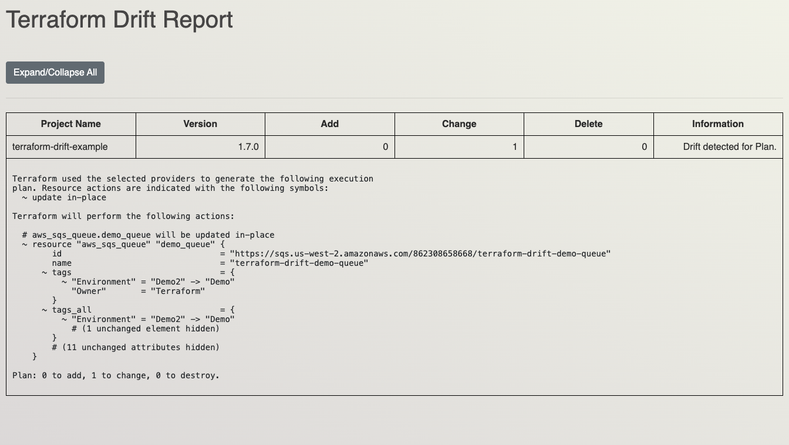

# TFDrift

A Terraform drift detection tool that scans your infrastructure for configuration drift by comparing your Terraform configuration with the actual state of your resources.



## Features

- Automatically detects Terraform infrastructure drift
- Scans multiple projects concurrently with batch processing
- Console table and interactive HTML report output
- Optional backend configuration support
- Configurable Terraform version
- CI/CD pipeline integration for automated drift detection
- Scheduled drift monitoring capabilities

## Requirements

- **Go**: Version 1.19 or higher
- **Terraform**: Automatically installs the specified version (defaults to 1.7.0)

## Installation

```bash
go build -o tfdrift .
```

## Usage

### Basic Drift Scan

Scan a directory and all its subdirectories for Terraform drift:

```bash
./tfdrift scan --path /path/to/terraform/projects
```

Recursively scans the path and all subdirectories for `*.tf` files.

### Options

```bash
# Generate HTML report
./tfdrift scan --path /path/to/projects --html

# Custom backend config (applies to all projects)
./tfdrift scan --path /path/to/projects --backend-config backend.cfg

# Custom Terraform version
./tfdrift scan --path /path/to/projects --terraform-version 1.8.0

# Verbose debug logging
./tfdrift scan --path /path/to/projects --verbose
```

## How It Works

1. Discovers all directories with `*.tf` files recursively
2. Processes projects in batches of 5 to avoid init conflicts
3. Runs `terraform init` and `terraform plan` for each project
4. Reports drift status with resource change counts

## Examples

The `examples/` directory contains sample Terraform configurations to demonstrate TFDrift functionality:

### Running Examples

To see drift detection in action with the provided examples:

1. **Deploy the infrastructure:**
   ```bash
   cd examples/terraform-drift-s3
   terraform init
   terraform apply
   ```

2. **Create drift by modifying resources outside Terraform** (e.g., change tags in AWS Console)

3. **Run TFDrift to detect the drift:**
   ```bash
   # From the project root
   ./tfdrift scan --path examples/terraform-drift-s3
   
   # Or scan all examples
   ./tfdrift scan --path examples/
   
   # Generate HTML report
   ./tfdrift scan --path examples/ --html
   ```

**Available Examples:**
- `terraform-drift-s3/` - AWS S3 bucket configuration
- `terraform-drift-sqs/` - AWS SQS queue configuration

**Note:** You need AWS credentials configured and actual resources deployed to see meaningful drift detection results.

## CI/CD Integration

TFDrift can be integrated into your CI/CD pipelines for automated drift detection:

### GitLab CI Example

```yaml
drift-detection:
  image: golang:1.19
  stage: monitor
  schedule:
    - cron: "0 6 * * *"
  script:
    - go build -o tfdrift .
    - ./tfdrift scan --path ./infrastructure --html
  artifacts:
    reports:
      junit: drift-report.html
    paths:
      - drift-report.html
    expire_in: 30 days
```

**Benefits of CI/CD Integration:**
- **Early Detection**: Catch drift before it impacts production
- **Automated Monitoring**: Regular scheduled scans without manual intervention
- **Historical Tracking**: Maintain drift reports over time
- **Team Notifications**: Alert teams when drift is detected
- **Compliance**: Ensure infrastructure stays aligned with defined configurations